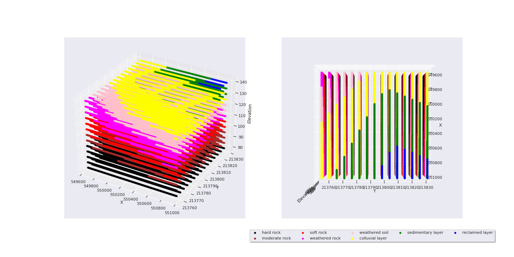

# Soil Properties Estimation
**NTB - Black data point (92 points)**

**Sample test area using trained model from NTB data**

`X_TEST_START = 549500`

`X_TEST_STOP = 551500`

`X_STEP = 50`

`Y_TEST_START = 213550`

`Y_TEST_STOP = 213950`

`Y_STEP = 50`

`ELEVATION_START = -20`

`ELEVATION_STOP = 44`

`ELEVATION_STEP = 10`

**Soil type assumption**

Soil type number. From down to bottom.

`assign_num_list = {'uncertain': 9,`
                    `'topsoil layer': 8,`
                    `'reclaimed layer': 7,`
                    `'sedimentary layer': 6,`
                    `'colluvial layer': 5,`
                   ` 'weathered soil': 4,`
                   ` 'weathered rock': 3,`
                    `'soft rock': 2,`
                   ` 'moderate rock': 1,`
                    ` 'hard rock': 0,`
                 ` }`
                 
 **Type color assumption**
 
`label_colours = ['black', 'brown', 'red', 'magenta',`
                `'pink', 'yellow', 'green',`
                `'blue','cyan','silver']`

**With these 3D Data points, we can extract the specific cross section. Sample as follow**

# Tutorial
- Step 1: Using [Step1_develop_regression_models.ipynb](Step1_develop_regression_models.ipynb) to training model base on NTB or TB or both.
- Step 2: Using [Step2_generating_estimated_results.ipynb](Step2_generating_estimated_results.ipynb) to generate test area predicted results
- Step 3: Using [Step3_visualize_3D_points_and_cross_sections.ipynb](Step3_visualize_3D_points_and_cross_sections.ipynb) for visualizing cross section interpolation images.

# Notes
- Check **model architecture** in [Step1_develop_regression_models.ipynb](Step1_develop_regression_models.ipynb) before making prediction.
