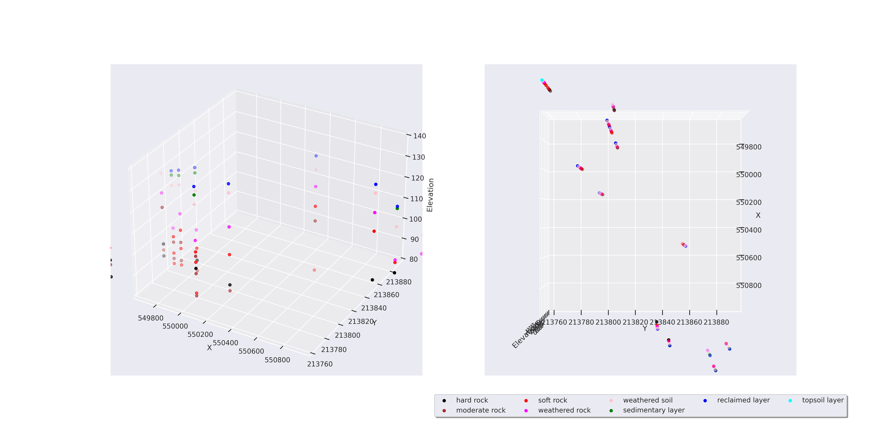

# Soil Properties Estimation
**NTB - Black data point (92 points)**

**Sample results using NTB**

`X_TEST_START = 549500`

`X_TEST_STOP = 551500`

`X_STEP = 50`

`Y_TEST_START = 213550`

`Y_TEST_STOP = 213950`

`Y_STEP = 50`

`ELEVATION_START = -20`

`ELEVATION_STOP = 44`

`ELEVATION_STEP = 10`

# Progress
- ANN and BNN model architecture development in [file](regression_models.ipynb)
- 3D estimated area visualization [file](3D_map_generation.ipynb) and [file](3D_map_generation.py)
- **Optimize model for creating suitablt results.**
