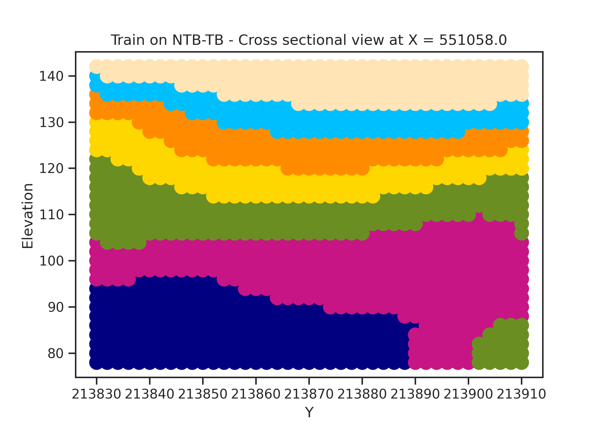

# **Soil Properties Estimation Using Deep Regression Neural Network**
## **NTB-TB data points**

## **Sample test area using trained model from NTB-TB data**

`X_STEP = 3`

`Y_STEP = 3`

`ELEVATION_STEP = 2`

### **Soil type assumption**

Soil type number. From down to bottom.

`assign_num_list = {`
                    `'topsoil layer': 7,`
                    `'reclaimed layer': 6,`
                    `'sedimentary layer': 5,`
                    `'weathered soil': 4,`
                    `'weathered rock': 3,`
                    `'soft rock': 2,`
                    `'moderate rock': 1,`
                     `'hard rock': 0,`
                  `}`
                 
 ### **Type color assumption**
 
`label_colours = ['navy', 'mediumvioletred', 'olivedrab', 'gold',`
                `'darkorange', 'deepskyblue', 'moccasin','moccasin']`
                
## **Predicted results - 3D point grid**

<!--  -->

**With these 3D Data points, we can extract the specific cross section. Sample as follow**

### **X-X Cross Section**

### **Y-Y Cross Section**

# Tutorial
- Step 1: Using [Step1_develop_regression_models.ipynb](Step1_develop_regression_models.ipynb) to training model base on NTB or TB or both.
- Step 2: Using [[Finalize]_Step2_generating_estimated_results_visualize_3_soil.ipynb]([Finalize]_Step2_generating_estimated_results_visualize_3_soil.ipynb) to generate test area predicted results
- Step 3: Using [[Finalize]_Step3_visualize_3D_points_and_cross_sections.ipynb]([Finalize]_Step3_visualize_3D_points_and_cross_sections.ipynb) for visualizing cross section interpolation images.

# Notes
- Check **model architecture** in [Step1_develop_regression_models.ipynb](Step1_develop_regression_models.ipynb) before making prediction.
