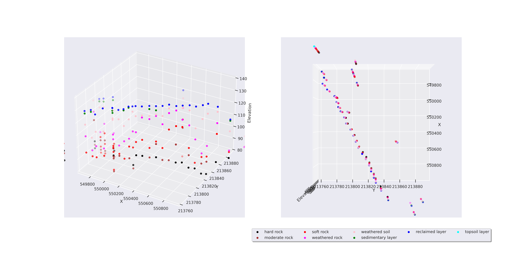
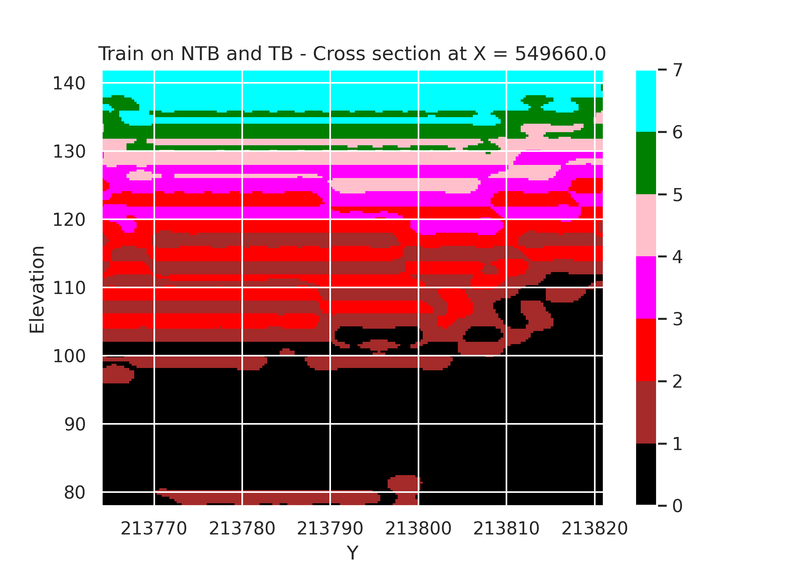
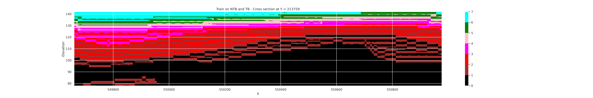

# Soil Properties Estimation
## **NTB-TB data points**

## **Sample test area using trained model from NTB-TB data**

### P1-P2-P5-P6 all region 

`X_TEST_START = 549648`

`X_TEST_STOP = 550977`

`X_STEP = 10`

`Y_TEST_START = 213758`

`Y_TEST_STOP = 213833`

`Y_STEP = 10`

`ELEVATION_START = 80`

`ELEVATION_STOP = 130`

`ELEVATION_STEP = 5`

### **Soil type assumption**

Soil type number. From down to bottom.

`assign_num_list = {`
                    `'topsoil layer': 7,`
                    `'reclaimed layer': 6,`
                    `'sedimentary layer': 5,`
                    `'weathered soil': 4,`
                    `'weathered rock': 3,`
                    `'soft rock': 2,`
                    `'moderate rock': 1,`
                     `'hard rock': 0,`
                  `}`
                 
 ### **Type color assumption**
 
`label_colours = ['black', 'brown', 'red', 'magenta',`
                `'pink', 'green',`
                `'blue','cyan','silver']`
                
## **Predicted results - 3D point grid**

**With these 3D Data points, we can extract the specific cross section. Sample as follow**

### **X-X Cross Section**

### **Y-Y Cross Section**

# Tutorial
- Step 1: Using [Step1_develop_regression_models.ipynb](Step1_develop_regression_models.ipynb) to training model base on NTB or TB or both.
- Step 2: Using [Step2_generating_estimated_results.ipynb](Step2_generating_estimated_results.ipynb) to generate test area predicted results
- Step 3: Using [Step3_visualize_3D_points_and_cross_sections.ipynb](Step3_visualize_3D_points_and_cross_sections.ipynb) for visualizing cross section interpolation images.

# Notes
- Check **model architecture** in [Step1_develop_regression_models.ipynb](Step1_develop_regression_models.ipynb) before making prediction.
